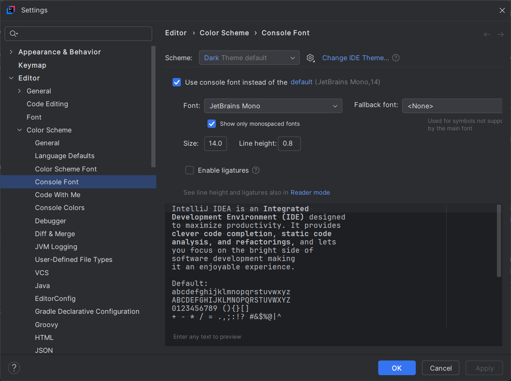

# Настройка консоли для отображения лабиринта

Для более приятного отображения лабиринта в консоли, рекомендуется настроить шрифт следующим образом:

## Настройка шрифта в IntelliJ IDEA:

1. Откройте настройки вашей IDE (например, IntelliJ IDEA).
2. Перейдите в раздел **Editor -> Color Scheme -> Console Font**.
3. Установите следующие параметры:
    - **Font**: JetBrains Mono (или другой моноширинный шрифт).
    - **Size**: 14.0 (можно отрегулировать под ваше удобство).
    - **Line height**: 0.8 (для более плотного отображения строк).
4. Включите опцию **Show only monospaced fonts** (использование только моноширинных шрифтов).

Настройки шрифта позволят вам видеть лабиринт с чётким отображением и симметрией, что важно для удобства работы с проектом.

### Пример настроек:

Настройте параметры как показано на изображении ниже:

## Рекомендации по использованию терминалов:
- Если вы работаете в другой среде, например, с терминалом Linux или macOS, убедитесь, что используемый шрифт также моноширинный (например, `Monaco`, `Consolas`, `Courier New`).
- В некоторых терминалах может потребоваться настроить размер шрифта и высоту строки вручную.

Эти настройки обеспечат вам наилучший опыт работы с консольным отображением лабиринта.
